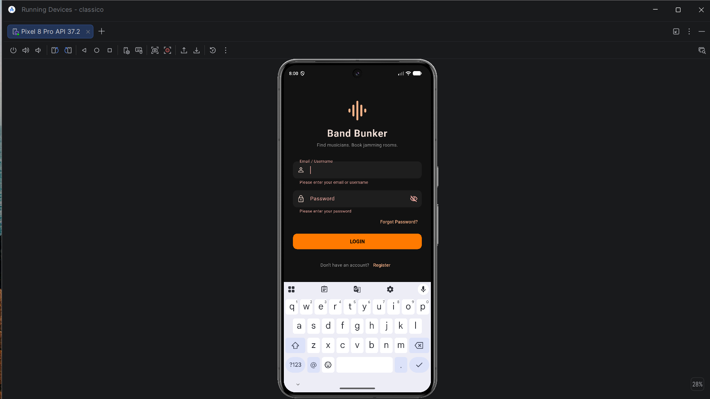
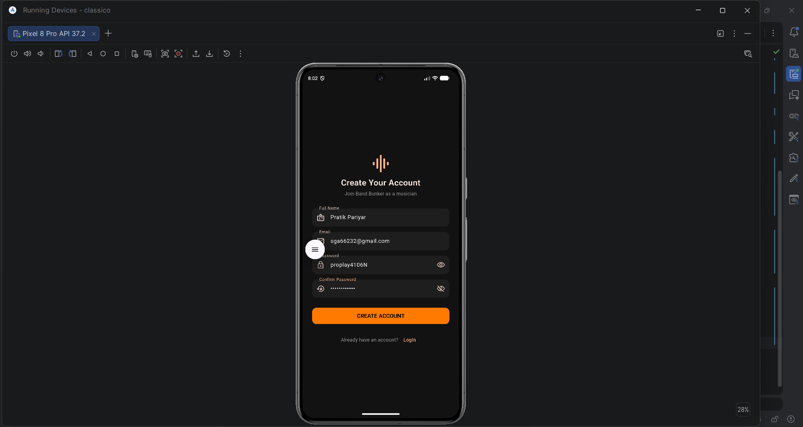

# Band Bunker

Bank Bunker is a Flutter-based mobile application designed to help musicians discover, connect,
and collaborate with other musicians. The platform allows the users to create a portfolio of musician,
showcase their achievements, and specify their musical roles such as vocalist, guitarist, pianist, drummer,
and more.

The main goal of Band Bunker is to make it easier for musicians to find suitable band members, discover
local musicians, and build connections within the local area music community.

The application also provides a platform for jamming room promoters to list their available spaces and
promote their services. Users can discover suitable jamming spaces, while promoters can receive bookings
and promote their spaces through the platform.

#Features
* User
- User registration and login
- Create and manage a musician profile
- Select musical role/instrument
- Discover other musicians
- Connect and network with musicians
- Discover local bands and band members who are potential in music.
- Find available jamming rooms.

* Promoter
- Promoter registration and Login
- Create and manage listings of jamming rooms
- Add information about jamming spaces
- Receive booking requests
- Promote their jamming rooms
- Advertise available spaces to musicians

* Admin
- Manage both users (Users and Promoters)
- Manage musician profiles
- Manage jamming room listings
- Monitor reported or inappropriate content
- Manage advertisements and promoted listings

## Screenshots

### Login Page

### Registration Page

# Technologies Used
- Flutter
- Dart
- Android Studio
- Git and GitHub

# How to Run the Project
- Clone the repository
  git clone https://github.com/pratik777215/flutter-login-interface.git 
- Open the Project
  Open the cloned project folder in Android Studio
- Install Dependencies
  Open the terminal inside the project folder and run: flutter pub get
- Run the Application
  Connect and Android device and start the Android emulator and then Run: flutter run / Click the Run Button in Android Studio